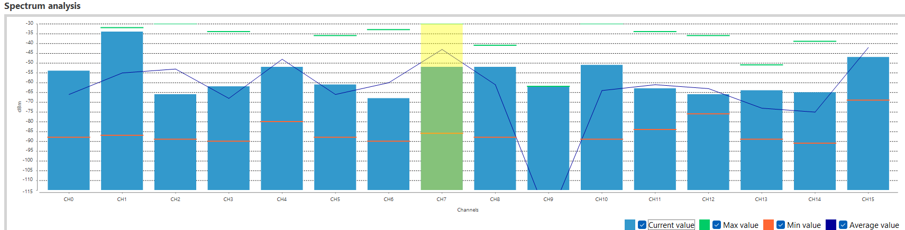
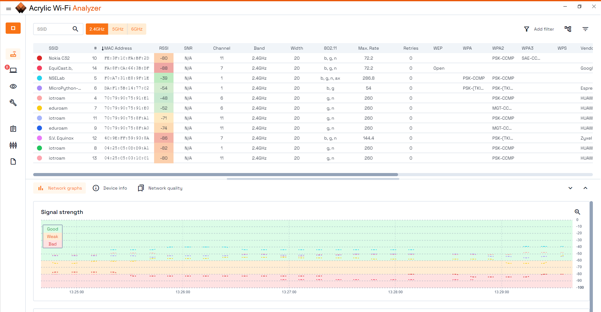
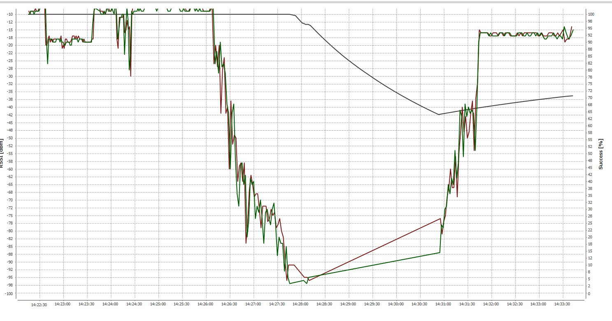

1. Wat zie je op de console van de ZC en ZED?
    
    - ZC: Alleen wat er werdt getypt
    - ZER: niks

2. wat zie nu op de consoles van de ZC en ZED en geef een verklaring.

    Console outputs van zowel verzenden als ontvangen. Dit komt omdat de zed nu wakker is.

3. wat zie nu op de consoles van de ZC en ZED en geef een verklaring.

    - ZC: alleen wat er zelf was getypt
    - ZER: Het bericht dat verzonden was van de ZC
    - verklaring: Het bericht van de ZC komt binnen bij de ZER omdat sleep time 28 seconden is, dit is de bufferingstime en aangezien ZED binnen 28 seconden aangezet is komt het bericht binnen. De reden dat het bericht van de ZER af niet binnen komt op de ZC omdat toen dat bericht getypt werd de ZEC in slaap stond

4. Welke parameter regelt deze 5 seconden

    ST - Wake Time

5. Waarom komt nu de tekst niet aan? Wat moet je wijzigen op er voor te zorgen dat de tekst wel aankomt?

    Omdat wanneer het bericht verstuurd wordt de ZED nog slaapt. Als het bericht op het moment dat de ZED aangaat wordt verstuurd dan komt het bericht wel aan.

    Om te zorgen dat de tekst wel aankomt moet de sleep time op de ZC naar 10 seconden of hoger gezet worden of moet de sleep time op de ZEC <= aan de sleep time van de ZC.

6. Geef de top 2 Zigbee kanalen (de XCTU én de officiële kanaalnummers) die het meest geschikt zijn om te gebruiken. Kijk naar de ‘Average value’, het laagste ‘ruis’ niveau (‘Min value’) en het laagste ‘signaal’ niveau (‘Max value’).

Het top kanaal is xctu nummer 7 en daarna 15. Dit staat gelijk aan het officiële nummer 18 en 26

7. Welk kanaal zou je kiezen? (officiële kanaalnummer)

    Ik zou kiezen voor kanaal 18 want deze heeft het hoogste average signaal en de minste ruis.

8. Zoek uit voor beide modules:

    a. Op welk kanaal staan ze ingesteld? (geef kanaalnummer in hexadecimale notatie).

    0xE

    b. Welk commando moet je vanuit de console geven om dit op te vragen?
    
    atch

9. Zoek uit en noteer:

    a. Wat is het ingestelde zendvermogen van beide modules? (in dBm en mW)

    dbm: 13

    mw: 19,95

    b. Welk commando moet je vanuit de console geven om dit op te vragen?

    atpp

    c. Noteer de verschillende power levels in dBm (je hebt hier de “Digi XBee3® Zigbee®
RF Module” manual bij nodig). Bereken hier ook de vermogens in mW bij.

    - 0 = -5 dBm = 0,32 mW
    - 1 = -1 dBm = 0,79 mW
    - 2 = +2 dBm = 1,58 mW
    - 3 = +5 dBm = 3,26 mW
    - 4 = +8 dBm = 6,31 mW

10. Wat is volgens de datasheet het maximale bereik in afstand voor deze module?

    3200 m

11. Stel het zendvermogen van beide modules in op -5dBm. Welk console commando moet je hier voor geven?

    atpl 0

12. Ga naar parameter SC. Welke waarde heeft deze nu?

    7FFF

13. Welke hexadecimale waarde heb je uiteindelijk bij SC ingesteld?

    8080

14. Welke waarde heeft deze nu?

    8080

15. Zet de antenne van de ene module verticaal en van de andere horizontaal.

    a. Wat is nu de RSSI waarde? Noteer de meetwaardes.

    -19 dBm en -19 dBm

    b. Wat is nu de RSSI waarde? Noteer de meetwaardes.

    -10 dBm en -10 dBm

    c. Welke conclusie kun je trekken uit de positie van de antennes?

    als de antennes beide omhoog staan is de RSSI waarde beter, zodra er één naar beneden gaat wordt deze slechter.

    d. Wat denk je dat de standaard positie van antennes is?

    omhoog

16. Wat is het laagste signaalniveau dat je binnen het pand kunt bereiken (waarbij je nog ontvangst hebt)? Geef de RSSI waarde en geef het lokaalnummer (welke afstand ongeveer?).

    lokaal 2.069

17. Maak een screenshot van je rangetest, sla deze op en laat hem aan de docent zien.

    

18. Als je een ‘battery powered’ IoT device bouwt, wat doe je dan met het zendvermogen?

    Je zet hem lager want dan bespaar je batterij

